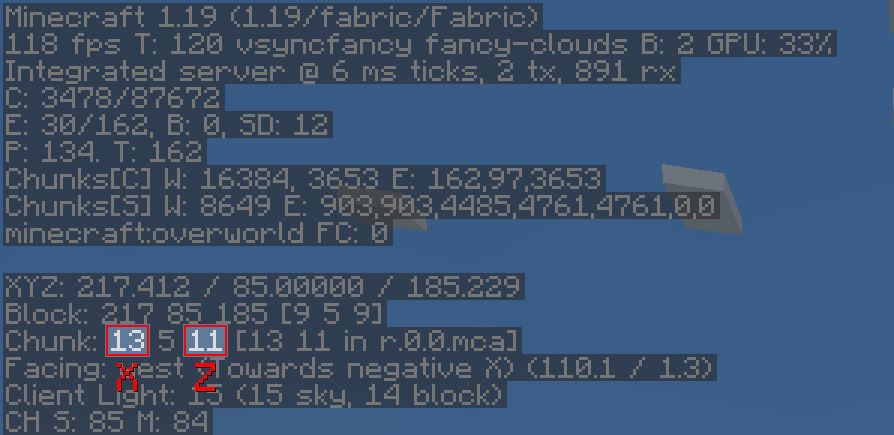

# WorldGen

*WorldGen* is a mod for pre-generating Minecraft worlds, with a main focus on ***speed***.

## Installation

Just download the latest *WorldGen* JAR file for your ***exact*** Minecraft version. 
Additionally, ***always*** ensure that you are using the correct version for your modloader (Fabric/Forge).
Then save the downloaded jar to the `mods` folder of your Minecraft instance.

Finally, if you are on Fabric you also need to download the
[Fabric API](https://modrinth.com/mod/fabric-api).

## Usage

*WorldGen* can be used to generate more chunks for an **existing World**. 
Simply select the world you want to expand from the World Selection screen and press the "WorldGen" button as seen below:

By default, existing chunks will not be overwritten and only new ones will be generated.

Also, please note that *WorldGen* uses **chunk** coordinates and **not** block coordinates! Since each Chunk
measures `16x16` blocks from a top-down view, you can easily convert between block and chunk coordinates by multiplying / dividing
by `16`. You can also find the current chunk position with the `F3` debug menu:

It is currently not possible to use *WorldGen* directly from the "Create New World" screen. Instead, you have
to first create the world normally, save and quit, and then open the world with *WorldGen*.

Furthermore, we recommend storing your world on an SSD (at least for running *WorldGen*). Using a hard drive can lead
to scenarios where new chunks are generated faster than previously generated chunks can be saved. This can cause out-of-memory
errors, since more and more chunks will accumulate in RAM as time goes on. Additionally, the performance
of the generator itself may be negatively affected. 

Although we consider *WorldGen* to be stable, it is recommended to back up your world before using this mod. 
We are not responsible if you lose your world because you ran into a bug!

## Recommended settings

When using *WorldGen*, there is no real upper limit on how many chunks can be generated. 
However, we do not recommend using a radius of more than `512` chunks (which would be `8192` blocks in each direction).

## How it works

In contrast to other existing chunk pre-generation methods our mod does not require a full Minecraft server to be running. 
Instead, a lightweight internal server is used to generate the chunks efficiently.

This has the advantage of having a **dedicated GUI** and allows **multithreading**. On the downside,
the world must be opened in a Minecraft client and cannot be loaded elsewhere while the chunks are being generated with *WorldGen*.

## Supported version

This table shows the current support status for the Minecraft version.

| Minecraft Version | Status            |
|-------------------|-------------------|
| `1.20`            | Supported         |
| `1.19`            | No future updates |
| `1.18.2`          | No future updates |

## FAQ

**Q:** *The progress screen does not fit and is cut off!*

**A:** Try reducing the GUI scale in the Minecraft video options until it fits 

---

**Q:** *How do I center the square / rectangle / circle around my current position?*

**A:** Click on the square button on the right of the Center chunk selection row. This will automatically load
   the last position of the player.

---

**Q:** *Will Minecraft versions before 1.18.2 be supported?*

**A:** No.

---

**Q:** *How do I reset chunks to their original state?*

**A:** First of all: **BACK UP YOUR WORLD!** Afterwards: In the advanced WorldGen settings enable the "Please allow me to
   break my world!" checkbox, then enable "Override existing chunks". Also, we recommend using the "Mode: Coordinates"
   in the main menu to reduce the chance of resetting chunks you don't want to!

---

**Q:** *How do I make a perimeter / replace all blocks in chunks with air?*

**A:** First of all again: **BACK UP YOUR WORLD!** Afterwards: In the advanced WorldGen settings enable the "Please allow me to
   break my world!" checkbox. Then, set "Max. chunk status" to `structure_starts`. Next, enable "Override
   existing chunks". Finally, set "Fake chunk status" to `full`. 
   The generation will stop early and save the chunk as a fully generated one.
   The "Max. chunk status" option allows stopping at different stages of generation, allowing for experimentation.

## Mod incompatibilities

This mod should be compatible with most mods (including those adding new biomes and dimensions).
However, mods that interfere with the Minecraft world generation process might pose a problem.

### Currently known incompatible mods

| Mod           | Failure                                                  |
|---------------|----------------------------------------------------------|
| **Starlight** | Chunks generated with WorldGen will have **no** lighting |

# Acknowledgments

Many thanks to the following projects for supporting open source development:

- GitHub for free code hosting
- The [Java profiler - JProfiler](https://www.ej-technologies.com/products/jprofiler/overview.html) for providing a profiling tool

